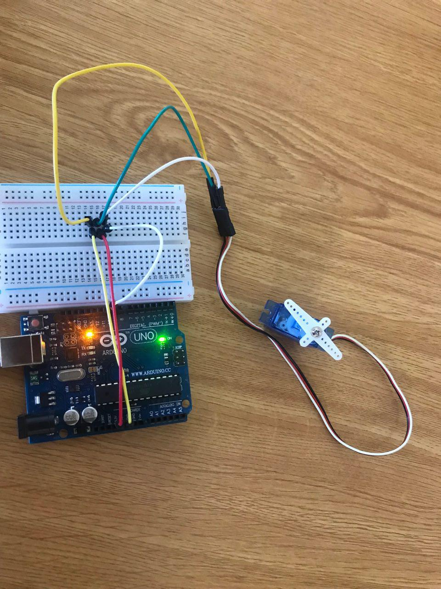

# Práctica Arduino 3 por Hakim y Eros
## Componentes:
- **4 leds (luz de colores)**

- **Un buzzer**

- **Una placa Arduino (por ejemplo la R3)**

```C
const int pinBuzzer = 9;

void setup() {
  // initialize the digital pin as an output.

  for ( int i = 10 ; i <= 13 ; i++)
  {
    pinMode(i, OUTPUT);
  }

}

void loop() {
    
  //generar tono de 440Hz durante 1000 ms
  tone(pinBuzzer, 440);
  delay(1000);

  //detener tono durante 500ms  
  noTone(pinBuzzer);
  delay(500);

  //generar tono de 523Hz durante 500ms, y detenerlo durante 500ms.
  tone(pinBuzzer, 523, 300);
  delay(500);
  
  for (int i=10 ; i <= 13 ; i++)
  {
       digitalWrite( i , HIGH) ;
       delay (200) ;
       digitalWrite( i , LOW);
       delay (200) ;
  } 
}
```
___
### Imágenes

___
### Funcionalidad
Emite sonido a través de buffer y se iluminan secuencialmente los LEDs. 